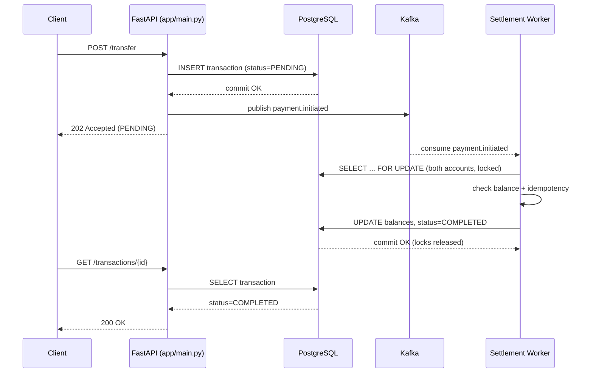

<div align="center">

# PayFlow

### Real-Time Event-Driven Payment Settlement System

*A fintech-grade settlement engine that decouples payment intake from money movement — with pessimistic locking that makes double-spending structurally impossible.*

[](https://www.python.org/)
[](https://fastapi.tiangolo.com/)
[](https://www.postgresql.org/)
[](https://kafka.apache.org/)
[](https://www.docker.com/)
[](LICENSE)

[Overview](#overview) • [Architecture](#architecture) • [Safety Guarantees](#safety-guarantees) • [Getting Started](#getting-started) • [API Reference](#api-reference) • [Testing](#testing-the-safety-guarantees)

</div>

---

## Overview

PayFlow simulates the core architecture behind real-world payment settlement systems — the kind of infrastructure that sits behind apps like Razorpay, PhonePe, or Google Pay. It is not a toy CRUD app: it models the actual hard problem in financial software, which is **correctness under concurrency**, not just "moving a number from A to B."

The system is split into two independently deployable services connected by a message broker:

- A **FastAPI service** that accepts transfer requests, validates them, and durably records intent — instantly, without waiting for settlement.
- A **Kafka-consumer worker** that performs the actual money movement asynchronously, using pessimistic database locking to guarantee that concurrent transfers can never corrupt account balances.

This separation is what makes the system *event-driven*: the API stays fast and responsive no matter how much settlement work is queued up behind it, and the worker pool can be scaled horizontally without touching the API at all.

A full browser-based demo UI is included, so the system can be seen working end-to-end, not just tested via curl.

<br>

## Why This Project Exists

Most portfolio CRUD projects don't touch the problem that actually makes financial engineering hard: **what happens when two things try to touch the same money at the same time?** PayFlow was built specifically to demonstrate:

- Understanding of **ACID transactions** and row-level locking, not just ORMs
- Comfort with **asynchronous, message-driven architecture**, not just synchronous REST
- Awareness of **distributed systems failure modes** — at-least-once delivery, idempotency, deadlocks — and how to design around them, not just around them working correctly

<br>

## Architecture



**Why split the API and worker into separate processes?** The API's only job is to durably record intent and respond immediately. The worker does the slow, careful work of actually moving money. This means a burst of traffic or a temporary settlement backlog never makes the API feel slow — and because Kafka consumer groups automatically load-balance across replicas, you can scale settlement throughput by simply running more worker containers, with zero code changes.

<br>

## Safety Guarantees

This is the part of the system worth understanding line-by-line — it's what separates this from a naive transfer implementation.

| # | Mechanism | Failure Mode It Prevents | Implementation |
|---|---|---|---|
| 1 | `SELECT ... FOR UPDATE` on both accounts | **Double-spend**: two concurrent transfers both reading a stale balance and both succeeding | `worker/consumer.py :: settle_transaction` |
| 2 | Deterministic lock ordering (accounts locked in sorted ID order) | **Deadlock**: two transfers targeting the same pair of accounts in opposite directions, each waiting on the other forever | `worker/consumer.py :: settle_transaction` |
| 3 | Client-supplied `idempotency_key` | **Duplicate transfers** from a retried HTTP request (network blips, client retries) | `app/main.py :: initiate_transfer` |
| 4 | Re-checking `status == PENDING` before settling | **Double-settlement** from Kafka's at-least-once delivery redelivering the same event | `worker/consumer.py :: settle_transaction` |
| 5 | `Numeric(14,2)` columns instead of `float` | **Floating-point drift** in cumulative money arithmetic | `app/models.py` |
| 6 | Kafka event published only *after* the DB commit succeeds | **Phantom events** referencing a transaction row that doesn't actually exist | `app/main.py :: initiate_transfer` |
| 7 | Single atomic DB transaction wrapping both balance updates | **Partial transfers** — money debited from sender but never credited to receiver | `worker/consumer.py :: settle_transaction` |

<br>

## Tech Stack

| Layer | Technology | Purpose |
|---|---|---|
| API | FastAPI + Uvicorn | Async HTTP layer, request validation via Pydantic |
| Database | PostgreSQL 16 | Durable storage; row-level locking via `FOR UPDATE` |
| ORM | SQLAlchemy 2.0 | Data models, session management |
| Message Broker | Apache Kafka 4.2 (KRaft mode) | Decouples transfer intake from settlement; no ZooKeeper required |
| Worker | `kafka-python-ng` consumer | Asynchronous settlement processor |
| Containerization | Docker + Docker Compose | One-command reproducible environment |
| Demo UI | Vanilla HTML/CSS/JS | Zero-build, dependency-free front end served directly by FastAPI |

<br>

## Project Structure

```
payment-settlement-api/
├── app/
│   ├── main.py            # FastAPI routes: users, accounts, transfers
│   ├── models.py           # SQLAlchemy models (User, Account, Transaction)
│   ├── schemas.py           # Pydantic request/response schemas
│   ├── database.py          # Engine, session, init_db()
│   ├── kafka_producer.py     # Publishes payment.initiated events
│   ├── seed.py               # CLI script to create demo accounts
│   ├── static/
│   │   └── index.html         # Self-contained demo UI
│   └── Dockerfile
├── worker/
│   ├── consumer.py            # Kafka consumer + settlement logic (the core!)
│   └── Dockerfile
├── tests/
│   └── test_concurrency.py    # Live proof that locking prevents double-spend
├── docker-compose.yml
├── requirements.txt
└── README.md
```

<br>

## Getting Started

### Prerequisites
- [Docker Desktop](https://www.docker.com/products/docker-desktop/) (with virtualization enabled)

### Run it

```bash
git clone https://github.com/<your-username>/payment-settlement-api.git
cd payment-settlement-api
docker compose up --build
```

Wait for `Application startup complete` and `Settlement worker started, listening...` in the logs.

### Try the demo UI

Open **http://localhost:8000** in your browser. Click the refresh icon to generate demo accounts, then send a transfer and watch it settle live — spinner, then a success/failure animation, with the activity feed updating in real time.

### Or drive it via the API directly

```bash
# Seed two demo accounts
docker compose exec api python -m app.seed

# Send a transfer
curl -X POST http://localhost:8000/transfer \
  -H "Content-Type: application/json" \
  -d '{"from_account_id": "<alice_id>", "to_account_id": "<bob_id>", "amount": 100}'

# Check settlement status
curl http://localhost:8000/transactions/<transaction_id>
```

Interactive API docs (auto-generated by FastAPI) are available at **http://localhost:8000/docs**.

<br>

## API Reference

| Endpoint | Method | Description |
|---|---|---|
| `/users` | `POST` | Create a user |
| `/accounts` | `POST` | Create an account for a user |
| `/accounts` | `GET` | List all accounts |
| `/accounts/{id}` | `GET` | Get a single account's balance |
| `/transfer` | `POST` | Initiate a transfer — returns `202 Accepted` immediately, settlement happens async |
| `/transactions` | `GET` | List recent transactions |
| `/transactions/{id}` | `GET` | Poll a specific transaction's settlement status |
| `/demo/seed` | `POST` | One-click demo data generator (used by the UI) |
| `/health` | `GET` | Liveness check |

<br>

## Testing the Safety Guarantees

The concurrency test is the centerpiece of this project — it doesn't just claim the system prevents double-spending, it proves it:

```bash
pip install requests
python tests/test_concurrency.py
```

**What it does:** creates an account with a balance of 100, then fires **two simultaneous** 80-unit transfers out of it at the exact same moment.

- **Without locking**, both requests could read the balance as 100 before either writes back, both see "sufficient funds," and both succeed — pushing the balance to **-60**. This is a real, historically-exploited class of bug in payment systems.
- **With the locking in this project**, the two settlement attempts are serialized by the database. Exactly one completes; the other correctly fails with `Insufficient funds`; the balance never goes negative.

```
Transaction 1: COMPLETED
Transaction 2: FAILED (Insufficient funds)
Final source balance: 20.00

PASS: exactly one transfer completed, balance never went negative.
```

<br>

## Roadmap

Ideas for extending this further:

- [ ] Reconciliation job to catch `PENDING` transactions stuck from a failed Kafka publish
- [ ] Dead-letter topic for transactions that repeatedly fail settlement
- [ ] Horizontal worker scaling demo (multiple replicas in the same consumer group)
- [ ] Webhook callbacks instead of client-side polling
- [ ] Rate limiting and auth on the public API
- [ ] Structured logging + distributed tracing (OpenTelemetry)

<br>

## License

This project is licensed under the MIT License — see [LICENSE](LICENSE) for details.

<br>

<div align="center">

Built as a deep-dive into event-driven architecture and transactional correctness in financial systems.

</div>
